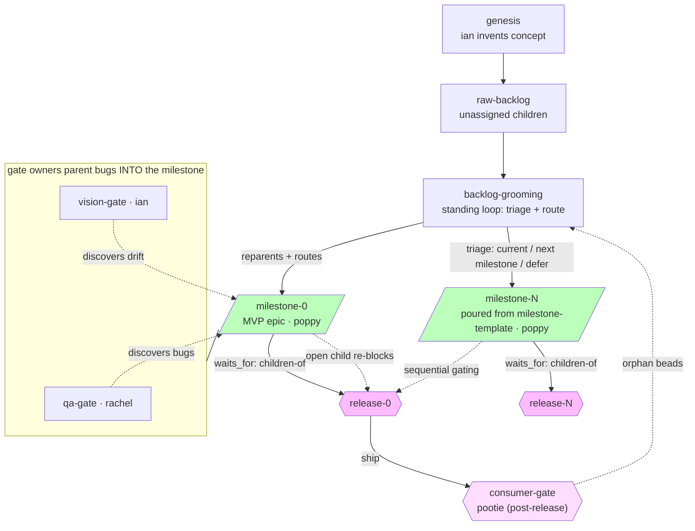

# Mythic Quest

An autonomous game-generation pipeline: **skills** that implement engine-specific actions, a **beads-driven molecule workflow** that orchestrates multi-loop development (dev → QA → vision → consumer), and **role-scoped agents** (build orchestrator + poppy implementer) with structural permission enforcement.

## Philosophy

- **Skills first**: Every capability is a documented skill (`SKILL.md`) — not prose buried in agents. Skills are engine-agnostic (top-level `skills/`) or engine-plugin specific (`plugins/engine/<engine>/skills/`).
- **Molecule-first orchestration**: The workflow is a dependency-ordered DAG (epic + children) poured from a formula. `bd ready` drives the frontier; no bash scripts, no hardcoded sequences.
- **Strict separation**: The orchestrator (build agent) owns the workflow but structurally cannot write game code. The implementer (poppy agent) writes code, mutates the ledger, verifies via MCP runtime. Permission frontmatter enforces this at the harness level.
- **Ledger isolation**: Pipeline-dev beads (infrastructure work) live in the repo's `.beads/`. Game-build beads (actual games) live in sandboxes under `test/`. They never mix.
- **MCP runtime as oracle**: Playtest closes on observed runtime behavior (input simulation, state assertions, screenshots) — never "stubs ready" or "compiles clean."

## Workflow Diagram



**Legend**:
- **Milestones (epics, green)**: the single converging backlog. Core tasks, gate-discovered bugs, and the gates themselves are all children. An epic cannot close while a child is open — that drain IS the convergence criterion; the rework loop needs no DAG cycle.
- **Releases (diamonds, pink)**: `waits_for = children-of(milestone)`. Adding any child (a new bug) re-blocks the release; it becomes ready exactly when the milestone drains and the orchestrator closes the epic.
- **Gates**: human-gate beads owned by their specialists (`bd gate resolve`). They never `needs` dev work — they're concurrent observers that parent their discoveries into the milestone.
- **Consumer gate (post-release)**: pootie reviews the *shipped* artifact and creates **orphan beads** (no parent — the customer doesn't know internal structure). The standing grooming loop triages them: current milestone, the next milestone (poured from `milestone-template.formula.toml` + one `dep add`), or deferred.
- **Two formulas**: `game-run.formula.toml` is the cross-milestone glue (backlog, grooming, consumer gate); `milestone-template.formula.toml` is the milestone anatomy (epic + gates + `waits_for` release), poured once per milestone at runtime — the count is unknowable at pour time, and each pour carries identical, lint-checked anatomy.
- Dashed arrows: discovery/triage flow; solid arrows: dependency/gating flow.

## Quick Start

### Prerequisites

- **beads** `1.3.0-rc.2` (pinned in `mise.toml`)
- **opencode** `1.18.30` (pinned in `mise.toml`)
- **Godot 4.7.2** on PATH (or `mise install godot`)

```bash
mise install  # Installs pinned toolchain
```

### Running a Game Build

1. **Initialize a sandbox** (creates fresh consumer repo + pins pipeline @ HEAD):
   ```bash
   .agents/skills/sandbox-init/scripts/init.sh opencode godot <sandbox-name>
   cd test/<sandbox-name>
   ```

2. **Launch the game-build session**:
   ```bash
   opencode
   ```
   The session reads the AGENTS.md contract (rendered by `init.sh`) and autonomously:
   - Runs genesis if no `VISION.md` exists
   - Pours the molecule epic and wires the backlog
   - Loops `bd ready --claim` → execute per skill → verify via MCP → close
   - Stops when the board is drained

3. **Monitor progress**:
   ```bash
   bd list --json | jq '.[] | "\(.id) \(.status) \(.title)"'
   ```

### Development Workflow (Pipeline-Dev)

All infrastructure changes happen in the pipeline repo itself:

```bash
# Check for ready work
bd ready --json

# Claim a task
bd update <id> --claim

# Implement, test, lint
# ...

# Close with verdict
bd close <id> --reason "PASS: ..."  # or "FAIL: ..."

# Push beads to Dolt remote
bd dolt push
```

## Architecture

```
mythic-quest/
├── agents/                    # Game-build agent profiles (mounted as .agents/agents/ in sandbox)
│   ├── build.md              # Orchestrator: workflow owner, edit deny, task: poppy-only
│   ├── poppy.md              # Implementer: game-tree writes, MCP verification, task: deny
├── skills/                   # Engine-agnostic skills
│   └── genesis/             # Creative director: VISION.md + BACKLOG.md
├── plugins/engine/godot/     # Godot plugin
│   ├── skills/              # Engine-specific skills
│   │   ├── init-project/    # Scaffold Godot project
│   │   ├── create-entity/   # Create player/NPC entities
│   │   ├── create-ui/       # Build HUD/menu scenes
│   │   ├── create-level/    # Assemble levels
│   │   └── playtest/        # MCP runtime verification
│   └── mcp.json             # Godot MCP server declaration
├── .agents/                  # Pipeline internals (pipeline-dev sessions only)
│   ├── lint/rules.yaml      # Governance SSOT
│   └── skills/
│       ├── lint/            # Lint skill (enforces rules.yaml)
│       └── sandbox-init/    # Sandbox preparation (renders AGENTS.md, MCP, agents)
├── mise.toml                # Toolchain pins (bd 1.3.0-rc.2, opencode 1.18.30)
└── test/                    # Sandboxes (disposable, gitignored)
    └── <sandbox-name>/      # Consumer repos with their own .beads/ ledgers
```

## Key Concepts

### Molecules (Workflow DAGs)

A molecule is an epic whose children form a dependency graph. The execution model:

```
epic-root (molecule)
├── genesis (no deps → ready)
├── dev-loop.1 (no deps → ready, parallel)
├── dev-loop.2 (no deps → ready, parallel)
├── playtest (needs dev-loop.*) → blocked until all dev-loop children close
└── release (needs playtest) → blocked until playtest closes
```

The orchestrator pours the molecule (via `bd mol pour` or imperative `bd create --parent`), then agents loop `bd ready --claim` → execute → close. Gates (human/timer/gh:run) can block steps without polling.

### Role Separation

Roles and their permission profiles are defined by the frontmatter of each
agent profile in [`agents/`](agents/) — `build`, `poppy`, `phil`, `stephen`,
`gustavo`, `rachel`, `ian`, `pootie`. That frontmatter is the single source
of truth; consult it directly rather than any restatement here.

Permissions are enforced by the harness (opencode's permission engine), not prose. Every allow-grant cites its justifying bead.

### MCP Runtime Verification

The Godot MCP server (`godot-mcp-runtime`) provides:
- `run_project` / `stop_project` — launch headless/background runs
- `get_debug_output` — capture stdout/stderr (catches parse errors `--check-only` misses)
- `simulate_input` — key presses, mouse clicks (tests input handling)
- `take_screenshot` — visual confirmation of rendering
- `run_script` — arbitrary GDScript assertions (state checks)

Playtest closes PASS only after observing behavior via these tools — e.g., "gold pickup added +8 gold and HUD text updated; potion healed +5 HP" — not "code compiles."

### Ledger Isolation

- **Pipeline-dev beads**: Track infrastructure work (skill fixes, lint audits, workflow changes). Reside in `/Users/mcanevet/src/github.com/mcanevet/mythic-quest/.beads/`.
- **Game-build beads**: Track actual game content (genesis, entities, levels, playtests). Reside in `/Users/mcanevet/src/github.com/mcanevet/mythic-quest/test/<sandbox>/.beads/`.

Physical separation ensures benchmarks are reproducible (each sandbox pins the pipeline @ committed HEAD) and game work never pollutes the infrastructure backlog.

## Validation History

- **Walkthrough 1** (mythic-quest-c8z): First M1 pipeline — genesis → init-project → create-entity → playtest. Identified schema-skew incident (fixed via `mythic-quest-93p`) and playability gaps.
- **Walkthrough 2** (test/walkthrough2): Validated `create-ui` + `create-level` + MCP runtime. Built "Lighthouse Keeper" end-to-end; MCP debug output caught 2 real bugs headless-only missed.
- **Walkthrough 3** (test/walkthrough3): Molecule-first orchestration with strict separation. Built "Mythic Quest" roguelike — 16/16 beads PASS, all closes on observed MCP behavior.
- **Walkthrough 4** (test/walkthrough4): M1.5 agent split validation. Built "Lanternfall" — 18/18 beads PASS, structural permission denial observed live, 1 mid-run discovery filed+fixed.

## Benchmarks

Benchmark runs live in `benchmarks/` (not yet created). Each run produces:
- `benchmarks/results/<date>-<game>-<engine>-<model>-<run>.md` — full transcript + verdicts
- `benchmarks/results/<date>-<game>-<engine>-<model>-<run>.jsonl` — structured bead events
- `benchmarks/results/<date>-<game>-<engine>-<model>-<run>.png` — final screenshot

Metrics tracked:
- Beads closed / PASS rate / FAIL rate
- Time to playable loop (genesis → first successful playtest)
- Discovery rate (mid-run `discovered-from` filings)
- MCP runtime coverage (% of closes backed by MCP vs. headless fallback)

## Contributing

1. **Find ready work**: `bd ready --json`
2. **Claim**: `bd update <id> --claim`
3. **Implement per skill conventions**: Read the relevant `SKILL.md` before acting.
4. **Lint**: `bd lint` (checks `.agents/lint/rules.yaml`)
5. **Close**: `bd close <id> --reason "PASS/FAIL: ..."`
6. **Push**: `bd dolt push` (syncs beads to Dolt remote)

## License

MIT — see LICENSE file.
